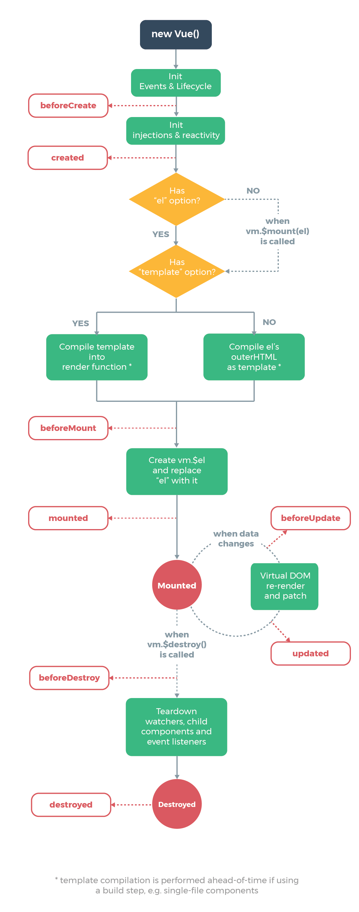

# VueJS.org

## [Style Guide](https://vuejs.org/v2/style-guide/)

- Rule categories:
  - Priority A: Essential (Error Prevention)
    - Multi-word component names
      - Component names should always be multi-word, *except* for root `App` components and built-in components provided by Vue (e.g., `<transition>` or `<component>`)
        - This prevents conflicts with current/future HTML elements, since all HTML elements are one word.
    - Component data
      - Component `data` must be a function
        - When using `data` on a component (anywhere except on `new Vue`), the value must be a function that returns an object.
          - When `data` is an object, it's shared across all instances of a component.
        - Note that using an object directly in a root Vue instance is acceptable, since it's a singleton.
    - Prop definitions
      - [Prop definitions](https://vuejs.org/v2/guide/components.html#Prop-Validation) should be as detailed as possible (specifying, at a minimum, types).
    - Keyed `v-for`
      - Always use `key` with `v-for`
        - Always required on components: Maintains internal component state down the subtree.
        - Good practice on elements (e.g., to maintain [object constancy](https://bost.ocks.org/mike/constancy/) in animations).
    - Avoid `v-if` with `v-for`
      - Never use `v-if` on the same element as `v-for`
        - `v-for` has a higher priority than `v-if`.
          - So, even if we only end up rendering a small number of the items, we still have to iterate through the entire list every time we re-render.
        - Two common pitfall situations:
          - Filtering items in a list
            - Instead, use a computed property that returns the filtered list.
          - Avoiding rendering a list if it should be hidden
            - Instead, move the `v-if` to a container element (e.g., `ul` or `ol`)
    - Component style scoping
      - Styles in a top-level `App` component and in layout components can be global. But all other components should be scoped.
        - Only relevant for [single-file components](https://vuejs.org/v2/guide/single-file-components.html) (i.e., `.vue` files).
        - Scoping can be done through:
          - `scoped` attribute
            - `<style scoped>`
          - CSS modules
          - `<style module>`
          - class-based strategy (such as [BEM](http://getbem.com/))
          - Another library/convention
      - Component libraries should use a class-based strategy instead of the `scoped` attribute.
    - Private property names
      - Use module scoping to keep functions private. If module scoping isn't possible, use the `$_` prefix.
        - Note that Vue uses the `_` prefix for its own private properties, so using this could lead to conflicts.
        - The `$` prefix is used for special instance properties that are exposed to the user.
        - So `$_` makes sense for user-defined private properties.
  - Priority B: Strongly Recommended
    - Component files
      - Whenever a build system is available to concatenate files, each component should be in its own file.
        - Helps with more quickly finding files.
    - Single-file component casing
      - Either always use PascalCase or kebab-case.
        - Note that PascalCase works best for autocompletion in code editors.
    - Base component names
      - Base components that apply app-specific styling and conventions should begin with a specific prefix, such as `Base`, `App`, or `V`.
        - Base components:
          - Presentational, dumb, or pure components.
          - Contain *only* HTML elements, other base components, and 3rd-party UI component.
          - Never contain global state (e.g., from a Vuex store).
          - Often contain the name of an element they wrap (e.g., `BaseButton` or `BaseTable`).
          - Webpack enables making these components available globally (without needing to import them).
    - Single-instance component names
      - Components that should only ever have a single active instance should being with `The`.
        - Indicates that a component should only be used once *per page* (not necessarily only being used on a single page).
        - These components don't accept any props.
    - Tightly-coupled component names
      - Child components that are tightly coupled with their parents should include the parent component name as a prefix.
        - This is preferred over nesting child components in directories named after their parents.
    - Order of words in component names
      - Component names should start with the highest-level (often most general) words and end with descriptive modifying words.
      - Nesting components inside directories is only recommended in large(100+ components) apps.
    - Self-closing components
      - Components with no content should be self-closing in single-file components, string templates, and JSX (e.g., `<My Component />`)- but never in DOM templates (e.g., `<my-component></my-component>`).
        - Self-closing:
          - Communicate that they have no content and are meant to have no content.
    - Component name casing in templates
      - Generally, component names should be PascalCase in single-file components and string templates (e.g., `<My Component />`) but kebab-case in DOM templates (`<my-component></my-component>`).
        - DOM templates must still use kebab-case due to HTML's case insensitivity.
        - Using kebab-case everywhere is also acceptable.
    - Component name casing in JS/JSX
      - Component names in JS/JSX should always be PascalCase.
        - They may be kebab-case strings for simple applications only using global component registration through `Vue.component`.
    - Full-word component names
      - Component names should prefer full words over abbreviations.
        - Clarity over brevity (especially with auto-completion).
    - Prop name casing
      - Prop names should use camelCase during declaration but kebab-case in templates and JSX.
        - E.g.:

          ```js
          // Good
          props: {
            greetingText: String
          }
          ```

          ```html
          <WelcomeMessage greeting-text="hi"/>
          ```

    - Multi-attribute elements
      - Elements with multiple attributes should span multiple lines, with one attribute per line.
    - Simple expressions in templates
      - Component templates should only include simple expressions, with more complex expressions refactored into computed properties or methods.
    - Simple computed properties
      - Complex computed properties should be split into as many simpler properties as possible.
    - Quoted attribute values
      - Non-empty HTML attribute values should always be inside quotes (either single or double: whichever isn't use in JS).
        - Style recommendation: Spaces inside braces.
    - Directive shorthands
      - Directive shorthands should be used always or never.
        - `:`: `v-bind:`
        - `@`: `v-on:`
        - `#`: `v-slot`
  - Priority C: Recommended
  - Priority D: Use with Caution

## [Tips & Best Practices](https://012.vuejs.org/guide/best-practices.html)

## Vue Guide

### [Introduction](https://vuejs.org/v2/guide/)

- Getting Started
  - [Hello World example](https://codesandbox.io/s/github/vuejs/vuejs.org/tree/master/src/v2/examples/vue-20-hello-world)
  - [Tutorial series on Scrimba](https://scrimba.com/g/gvuedocs)
- Declarative Rendering
  - Directives
    - Are prefixed with `v-`.
    - Apply special reactive behavior to the rendered DOM.
    - `v-bind:`
      - Bind element attributes
    - `v-if`
      - Conditional presence
    - `v-for`
      - Loop through an array
    - `v-on`
      - Attach event listeners that invoke methods on our Vue instances
    - `v-model`
      - For two-way binding between form input and app state.
- Composing with Components
  - A component: Vue instance with pre-defined options.
  - Registering a component with a prop

    ```jsx
    // Define a new component called todo-item
    Vue.component('todo-item', {
      props: ['todo'],
      template: '<li>This is a todo</li>'
    })

    var app = new Vue({
      el: '#app',
      data: {
        groceryList: [
          { id: 0, text: 'Vegetables' },
          { id: 1, text: 'Cheese' },
          { id: 2, text: 'Other stuff' },
        ]
      }
    })

    // Compose it in another component's template
    <div>
      <ol>
        <todo-item
          v-for="item in groceryList"
          v-bind:todo="item"
          v-bind:key="item.id"
        >
        </todo-item>
      </ol>
    </div>
    ```

  - Example app template:

    ```html
    <div id="app">
      <app-nav></app-nav>
      <app-view>
        <app-sidebar></app-sidebar>
        <app-content></app-content>
      </app-view>
    </div>
    ```

  - Vue component syntax is loosely modeled after Web Components Spec, but differs:
    - Vue components don't require polyfills and work consistently in all browsers (IE9 and above)
    - Vue components support cross-component data flow, custom event communication, and build tool integrations.

### [The Vue Instance](https://vuejs.org/v2/guide/instance.html)

- Creating a Vue instance
  - Every Vue application starts with creating a new Vue instance with the `Vue` function.

    ```js
    var vm = new Vue({
      // options
    })
    ```

  - Note that `vm` is often used as a shorthand for `ViewModel`, referring to the Vue instance.
  - See the full list of options in the [API reference](https://vuejs.org/v2/api/#Options-Data)
  - All components are Vue instances and accept the majority of the same options (except for root-specific ones).
- Data and Methods
  - When a Vue instance is created, it adds all the properties in its `data` object to Vue's reactivity system.
    - When the values of these properties change, the view 'reacts', updating to match the new values.
    - When the data changes, the view will re-render.
    - Properties in `data` are only reactive if they existed when the instance was created.
      - If you add a new property, changes to that property won't trigger any view updates.
      - To be reactive, all properties must be provided initial values.
      - note that calling `Object.freeze(dataObj)` prevents existing properties from being changed &rarr; the reactivity system can't track changes.
  - Vue's instance properties and methods are prefixed with `$` to differentiate them from user-defined properties.

    ```js
    vm.$data === data //true
    vm.$el === document.getElementById('example') // true
    vm.$watch('a', function (newValue, oldValue) {
      // This callback will be triggered when `vm.a` changes
    })
    ```

  - Refer to the full list of instance properties and methods in the [API reference](https://vuejs.org/v2/api/#Instance-Properties)

- Instance Lifecycle Hooks
  - `created` hook
    - Can be use to run code after an instance is created

    ```js
    new Vue({
      data: {
        a: 1
      },
      created: function () => {
        // `this` points to the vm instance
        console.log('a is:' + this.a)
      }
    })
    ```

  - `mounted`
  - `updated`
  - `destroyed`
  - Note that all lifecycle hooks are called with their `this` context pointing to the Vue instance invoking it.
    - Don't use arrow functions on an options property or callback.
      - An arrow function doesn't have a `this`, so `this` will be treated as any other variable and lexically looked up through parent scopes until found.
        - Common errors:
          - `Uncaught TypeError: Cannot read property of undefined`
          - `Uncaught TypeError: this.myMethod is not a function`
  - 
