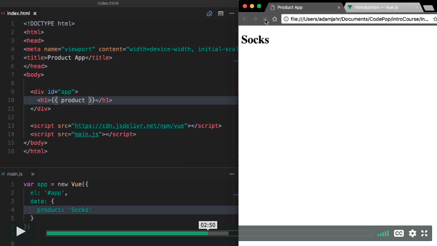
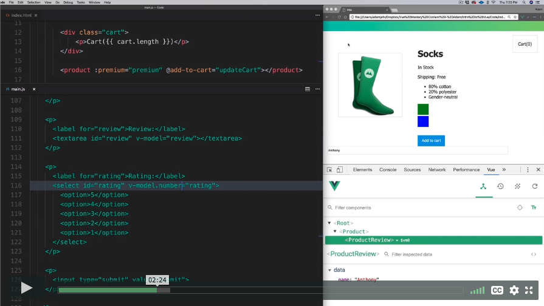
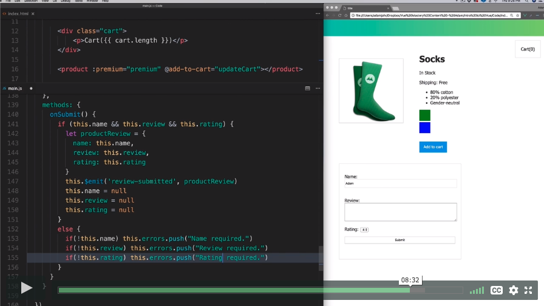

# Intro to Vue.js

## [1. The Vue Instance](https://www.vuemastery.com/courses/intro-to-vue-js/vue-instance)

- Vue dev tools (Chrome or FireFox)
  - Can see structure of application, as well as data, props, etc.
  - Must check `Allow access to file URLs`.
- Simplest Vue application:
  - 

## [2. Attribute Binding](https://www.vuemastery.com/courses/intro-to-vue-js/attribute-binding)

- `v-bind`
  - Dynamically binds an attribute to an expression.
  - 
  - 
  - Fully syntax:
    - `v-bind:alt="description"`
  - Shorthand:
    - `:alt="description"`

## [3. Conditional Rendering](https://www.vuemastery.com/courses/intro-to-vue-js/conditional-rendering)

- Conditional directives: `v-if`, `v-else-if`, `v-else`
  - 
  - `v-if` will actually add or remove this element from the DOM.
    - If we're dealing with an element that will be being shown and hidden frequently, `v-show` can be more performant. Rather than adding or removing it from the DOM, it toggles `display: none;`.
    - 

## [4. List Rendering](https://www.vuemastery.com/courses/intro-to-vue-js/list-rendering)

- `v-for`: Loops over each item in an array
  - 
  - It's highly recommended to use a `key` so Vue can keep track of the element.
    - 

## [5. Event Handling](https://www.vuemastery.com/courses/intro-to-vue-js/event-handling)

- `v-on`: Listens for specified event, then performs the attached expression.
  - 
  - 
  - Shorthand: `@`
  - 
    - Can also use shorthand (though some browsers may not support it):
      - 
- Event examples:
  - `@click`
  - `@mouseover`
  - `@submit` (on a `<form>`)
  - `@keyup.enter`
    - Note that `.enter` is a modifier.

## [6. Class & Style Binding](https://www.vuemastery.com/courses/intro-to-vue-js/class-&-style-binding/)

- Style binding
  - 
  - Can use camelCase (because it's in an object); can also use kebab-case, but the property must be wrapped in quotation marks.
    - 
  - Can also bind to a style object. This is often preferable.
    - 
  - The styles from multiple objects can be added via an array.
    - 
- Class bindings
  - 
    - This *adds* classes: Any classes that are directly assigned to the element are still present.
  - This assigns the `.disabledButton` class (from the style sheet) whenever `inStock` is falsy:
    - 
  - We can also bind an object of classes:
    - 
  - We can also add an array of classes:
    - 
  - We can also apply classes conditionally:
    - 

## [7. Computed Properties](https://www.vuemastery.com/courses/intro-to-vue-js/vue-computed-properties)

- `computed` properties:
  - 
  - The computed property is cached and updates each time its dependencies change.
    - So it's more efficient to use a computed property than a method.
  - Approach 1: Updating image through method.
    - 
  - Approach 2: Updating image through computed property.
    - 

## [8. Components](https://www.vuemastery.com/courses/intro-to-vue-js/components)

- Register a component via `Vue.component('componentName', {})`
- Options object
  - `template`
    - Template literal uses backticks.
      - [7 Ways to Define a Component Template in VueJS](https://medium.com/js-dojo/7-ways-to-define-a-component-template-in-vuejs-c04e0c72900d)
    - Template must return a single root element (e.g., wrapping `div`).
    - `data`: A function that returns a data object.
      - So that each instance of the component can have its own data.
    - `props`
      - In order to receive props, a component must explicitly declare which props it expects to receive in a `prop` array.
        - 
      - Recommendation: Use a `prop` object instead, with prop validation.
        - 
      - 
    - `methods`
    - `computed`

## [9. Communicating Events](https://www.vuemastery.com/courses/intro-to-vue-js/communicating-events)

- Emitting an event
  - `this.$emit('event-name')`
  - 

## [10. Forms](https://www.vuemastery.com/courses/intro-to-vue-js/forms)

- The `v-model` directive gives us two-way data binding.
  - 
- `number` in `v-model.number` is a modifier that casts `rating` to a number.
  - 
- The `.prevent` modifier prevents the default behavior (in this case,  the page from refreshing when the form is submitted).
  - 
- 
- Sending our `productReview` object up to our parent:
  - 
  - 
  - 
  - 
- Can use HTML5 `required` attribute for required fields.
  - 
- Custom validation
  - Building an errors array:
    - 
    - 
- Resources:
  - [Modifiers](https://vuejs.org/v2/guide/forms.html#Modifiers)
  - [Event Modifiers](https://vuejs.org/v2/guide/events.html#Event-Modifiers)
  - [Custom Validation](https://vuejs.org/v2/cookbook/form-validation.html#Another-Example-of-Custom-Validation)

## [11. Tabs](https://www.vuemastery.com/courses/intro-to-vue-js/tabs)

- 
- 
- 
- But ProductReview is now a grandchild of Product (through ProductTabs). So `addReview` is not defined.
  - We'll define a new global Vue `eventBus` instance
    - 
    - 
    - As soon as the Product component is mounted to the DOM, listen for the `review-submitted` event.
      - 
- Resources
  - [Real World Vue.js](https://www.vuemastery.com/courses/real-world-vue-js/real-world-intro/) for life cycle hooks, Axios, routing, etc.
  - [Vuex](https://vuex.vuejs.org/) for more advanced state management
